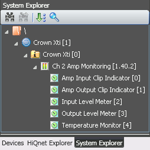

# node-hiqnet

This is a library to allow NodeJS applications to communicate with devices that
speak the HiQnet protocol.  This protocol is used in commercial audio products
by a number of companies that sit under the Harman International brand.

## Status

The library can currently read values from devices over USB only.  TCP/IP and
RS232 transports can be implemented but I lack any devices to use for testing.

What works:

* Passing HiQnet messages over USB.
* Some HiQnet commands:
  * locate - make device LEDs blink for identification
  * multiGetParameter - read values from device

What hasn't been implemented yet:

* Device discovery.
* Passing HiQnet messages over TCP/IP or RS232.
* Address negotiation (less important for USB comms).
* Handling errors at the USB transport layer.
* Message sequence numbers.
* Multipart HiQnet messages.
* Functions for calling many of the HiQnet commands.

## Parameters and addressing

HiQnet has an addressing structure whereby the destination address specifies
the path from the physical device right down the tree to an individual
parameter.

This example image is a screenshot from Harman's *System Architect* application:

Beginning from the top and working down the tree:

* The physical device ID is **1**.
* The virtual device ID is **0**.
* The object ID is **1.40.2**.
* The parameter ID is **4** for the *Temperature Monitor* value.

To retrieve that parameter using this library, the call is structured like this:

    const address = {
      device: 0,
      virtualDevice: 1,
      object: [1, 40, 2],
    };
    
    const parameters = [4];  // can specify multiple
    
    const result = await hiq.multiParamGet(address, parameters);
    
    console.log('Temperature Monitor:', result[4]);

## Extracting parameter lists

This example shows how to extract a list of available parameters from the
*System Architect* software.  It requires a Windows install to obtain the files,
but the extraction is done under Linux.

1. Go to `C:\Program Files\Harmon Pro\System Architect X.XX` and copy the DLL
   for the product in question, such as `CrownXTiCDiSDi.dll`, onto a Linux
   machine.

2. Get the offsets for the start of the XML data:

       $ grep -F --byte-offset --only-matching --text '<Product' CrownXTiCDiDSi.dll
       3815916:<Product
       3872268:<Product
       3928380:<Product

3. Extract the XML.  We have to add 1 to the offsets reported by `grep` for some
   reason:

       tail -c +3815917 CrownXTiCDiDSi.dll | xmllint --format --recover - > 1.xml
       tail -c +3872269 CrownXTiCDiDSi.dll | xmllint --format --recover - > 2.xml
       tail -c +3928381 CrownXTiCDiDSi.dll | xmllint --format --recover - > 3.xml

4. Look through the XML files for the one that matches the product you need.

       $ grep '<Product' *.xml
       1.xml:<Product ClassID="47" Name="Crown CDi">
       2.xml:<Product ClassID="48" Name="Crown DSi">
       3.xml:<Product ClassID="46" Name="Crown XTi">
